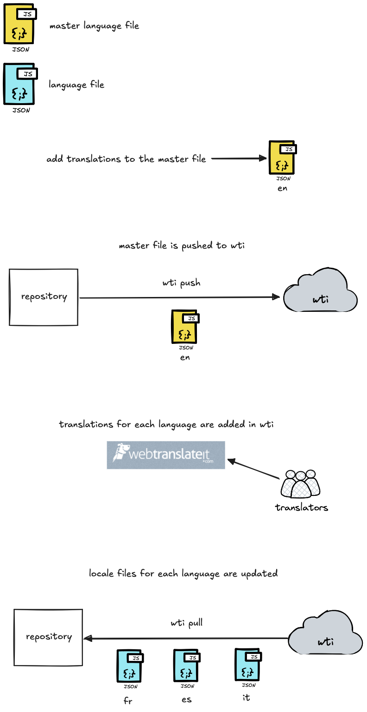

<div align="center">
    
#### A [WebTranslateIt](https://webtranslateit.com/) command-line tool in Node.js by

[](https://treatwell.com/tech)

[](https://www.npmjs.com/package/@treatwell/wti)
[](https://github.com/treatwell/wti/actions)
[](http://commitizen.github.io/cz-cli/)
[](https://github.com/prettier/prettier)
[](https://github.com/semantic-release/semantic-release)


</div>

# Usage

**Installation**

```sh
$ yarn add @treatwell/wti
```

**Configuration**

Basically, `wti` is to be run on a project root directory, and looks for a `wti-config.json` file containing your project's information.

The command `wti init` lets you create this file.

```sh
$ wti init
What is your project's api key?: <your private key>
Initializing...... [SUCCESS] Project is initialized
```

You can find the API token in your project settings.

Note that if your config is in a different directory then you can pass this with
`--configPath` to any command that needs it:

```
wti push --configFile ./config/wti-config.json
```

**Usage**

Execute `wti help` to see the usage:

```sh
USAGE
  $ wti [COMMAND]

COMMANDS
  add        create and push a new master language file
  addLocale  add a new locale to the project
  help       display help for wti
  init       configure the project to sync with
  pull       pull target language file(s)
  push       push master language file
  rm         delete a master language file from a project

See `wti help <command>` for more information on a specific command.
```

# Sample commands

| Command                            | Action                                |
| ---------------------------------- | ------------------------------------- |
| wti add <path/to/master/file.json> | Upload a new **master** language file |
| wti rm <path/to/master/file.json>  | Delete a **master** language file     |
| wti push                           | Update a **master** language file     |
| wti pull                           | Download target language files        |
| wti addLocale fr                   | Add a new locale to the project       |
| wti rmLocale fr                    | Remove a locale from the project      |
| wti status                         | View project statistics               |

# Overview



# i18next example

**1. Prerequisite**

- Create a project on WebTranslateIt with a source language (such as english)
- Bootstrap a React app

**2. Install and configure i18next**

```sh
$ yarn add i18next react-i18next
$ yarn add -D i18next-parser

// Extract locales
$ i18next --config i18next-parser.config.js
```

**3. Install and configure WTI client**

```sh
$ yarn add -D wti
$ wti init
$ wti add locale fr
$ ... add other languages
$ wti add locales/en/translation.json
$ wti push
```

**4. Translate keys on WebTranslateIt, and then pull translations**

```sh
$ wti pull
```

**5. Add or remove translation keys**

```sh
$ i18next --config i18next-parser.config.js
$ wti push
```
